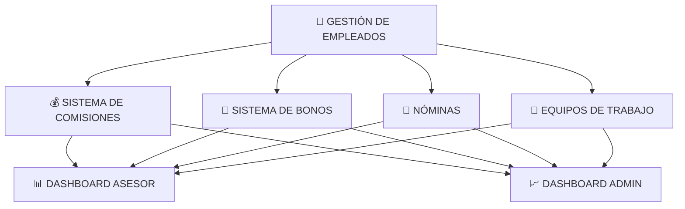
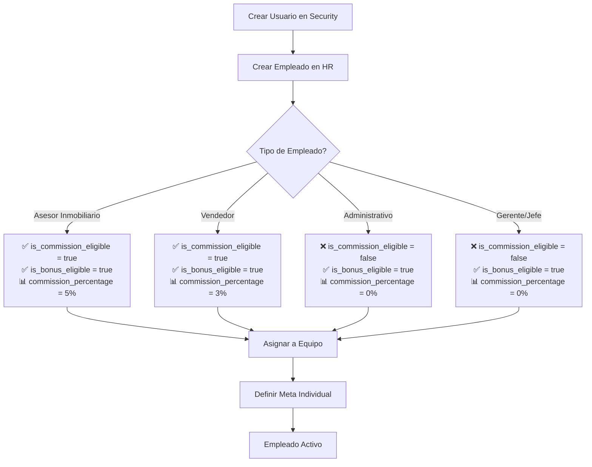
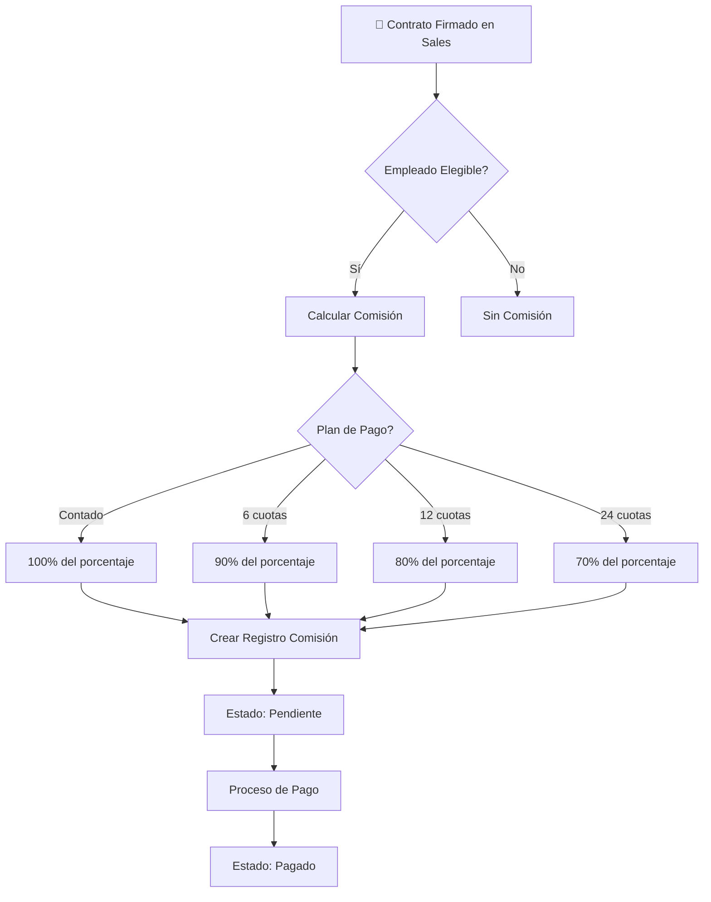
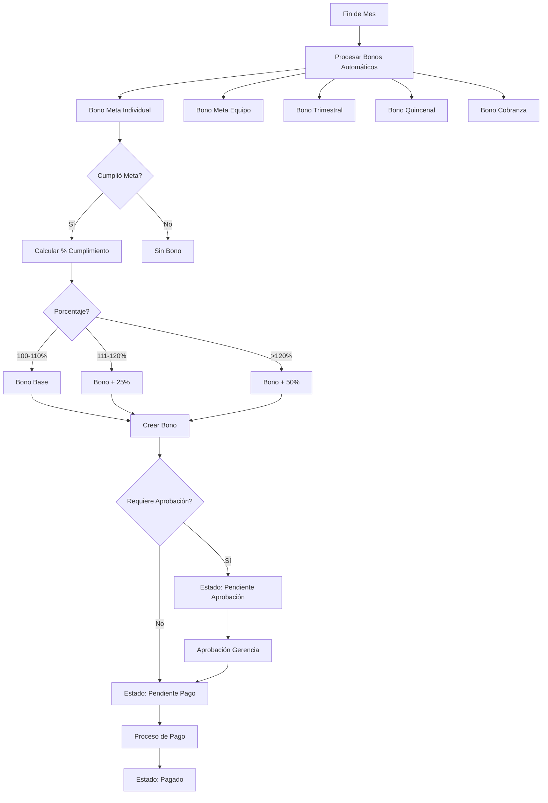
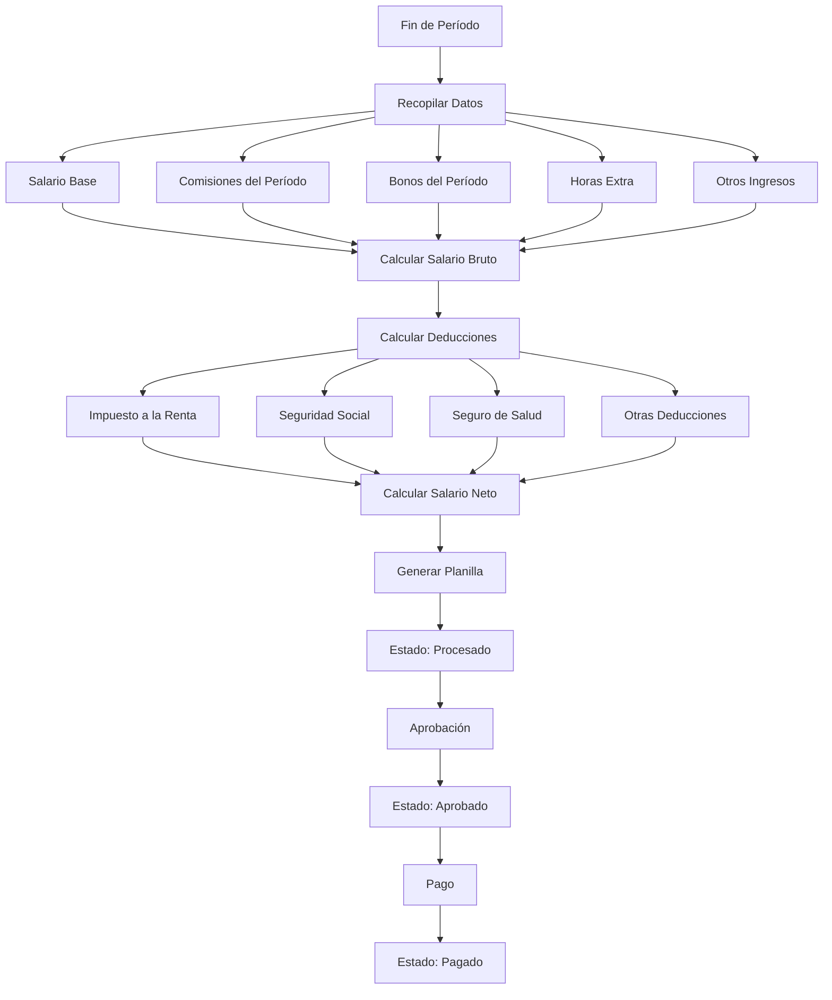
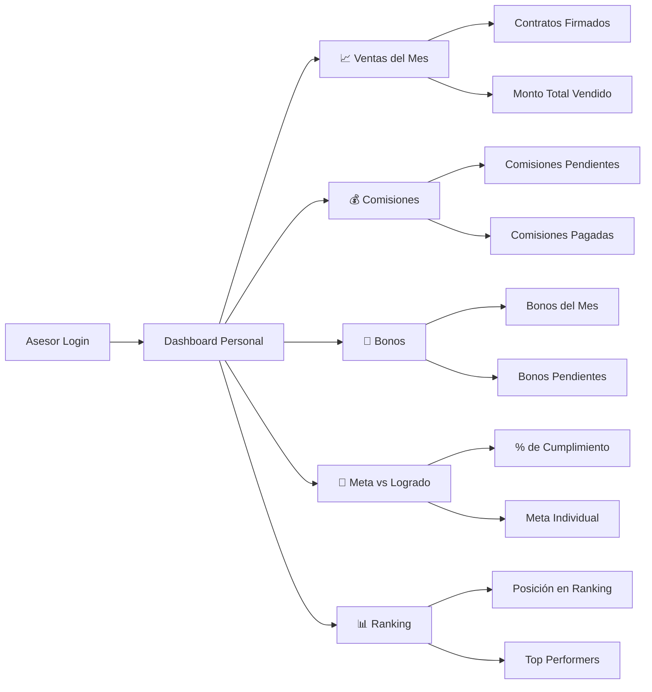
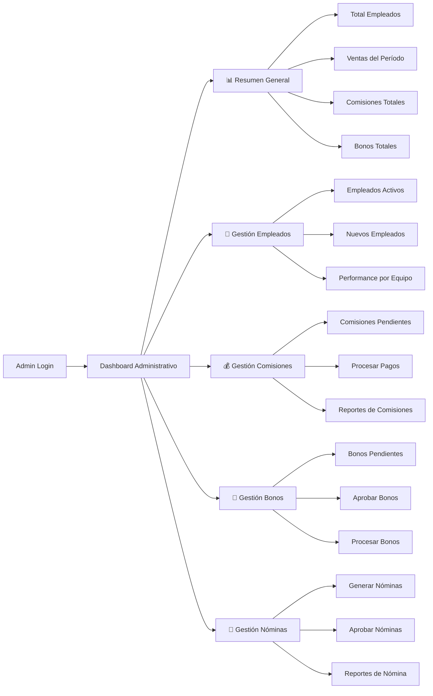
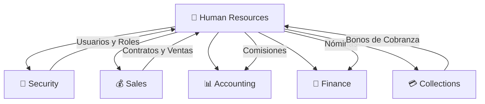

# 📋 FLUJO DE FUNCIONAMIENTO - MÓDULO RECURSOS HUMANOS

## 🎯 VISIÓN GENERAL DEL SISTEMA

## 🔄 FLUJO PRINCIPAL DE PROCESOS

### 1. 👤 GESTIÓN DE EMPLEADOS

### 2. 💰 SISTEMA DE COMISIONES

### 3. 🎁 SISTEMA DE BONOS

### 4. 💼 SISTEMA DE NÓMINAS

## 📊 DASHBOARDS Y REPORTES

### 🎯 Dashboard del Asesor

### 👨‍💼 Dashboard del Administrador

## 🔄 PROCESOS AUTOMÁTICOS

### ⏰ Tareas Programadas

```mermaid
gantt
    title Procesos Automáticos del Sistema HR
    dateFormat  DD
    axisFormat %d
    
    section Diario
    Actualizar Métricas    :active, daily1, 01, 1d
    Sincronizar Ventas     :active, daily2, 01, 1d
    
    section Semanal
    Reporte Performance    :weekly1, 07, 1d
    Backup Datos HR        :weekly2, 07, 1d
    
    section Quincenal
    Procesar Bonos Quincenales :biweekly1, 15, 1d
    
    section Mensual
    Procesar Comisiones    :monthly1, 30, 1d
    Procesar Bonos Mensuales :monthly2, 30, 1d
    Generar Nóminas        :monthly3, 30, 1d
    
    section Trimestral
    Bonos Trimestrales     :quarterly1, 90, 1d
    Evaluación Performance :quarterly2, 90, 1d
```

## 🎯 TIPOS DE EMPLEADOS Y CONFIGURACIONES

| Tipo de Empleado | Comisiones | Bonos | % Comisión | Meta Individual |
|------------------|------------|-------|------------|-----------------|
| **Asesor Inmobiliario** | ✅ Sí | ✅ Sí | 5% | ✅ Sí |
| **Vendedor** | ✅ Sí | ✅ Sí | 3% | ✅ Sí |
| **Administrativo** | ❌ No | ✅ Sí | 0% | ❌ No |
| **Gerente** | ❌ No | ✅ Sí | 0% | ❌ No |
| **Jefe de Ventas** | ❌ No | ✅ Sí | 0% | ❌ No |

## 🔗 INTEGRACIÓN CON OTROS MÓDULOS

## 📈 MÉTRICAS CLAVE

- **Performance Individual**: Ventas vs Meta
- **Performance de Equipo**: Cumplimiento grupal
- **Comisiones**: Pendientes, pagadas, totales
- **Bonos**: Por tipo, por empleado, por período
- **Nóminas**: Costos totales, deducciones, neto
- **Ranking**: Top performers del mes/trimestre

---

*Este flujo representa el funcionamiento completo del módulo de Recursos Humanos, desde la gestión básica de empleados hasta los procesos automatizados de comisiones, bonos y nóminas.*